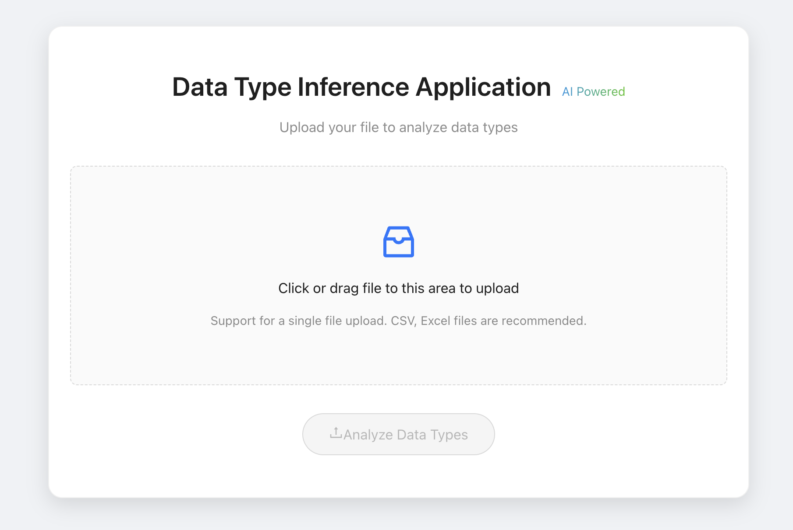
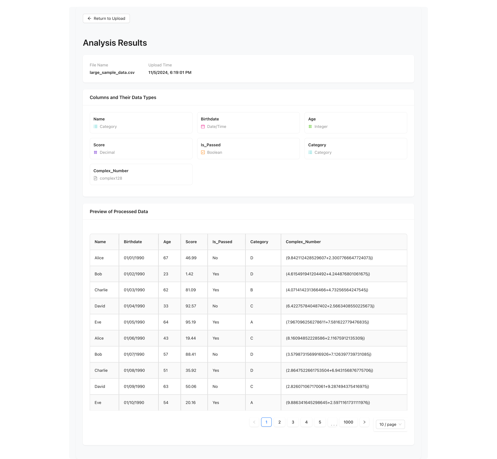

# R_AI 📊

> A powerful data analysis application built with Django REST Framework and React.

## ✨ Features

- 📁 Intelligent file upload and analysis
- 🔍 Automatic data type inference
- 📊 Support for CSV and Excel files
- 💾 MongoDB integration for data persistence
- 📈 Interactive data visualization
- 🚀 Real-time analysis updates

## 🛠️ Tech Stack

### Backend

- Django & Django REST Framework
- Pandas for data processing
- MongoDB (with Djongo) for database
- Python data analysis libraries

### Frontend

- React 18
- Vite for build tooling
- Ant Design components
- Axios for API requests

## 🚀 Getting Started

### Backend Setup

See 📒 [Backend README](backend/README.md) for detailed setup instructions.

### Frontend Setup

See 📕 [Frontend README](frontend/README.md) for detailed setup instructions.

## Our Testing

See 📘 [Testing README](testing/README.md) for detailed testing instructions.

## 🔌 API Endpoints

| Endpoint                       | Method | Description                               |
| ------------------------------ | ------ | ----------------------------------------- |
| `/api/upload/`                 | POST   | Upload and analyze data files (CSV/Excel) |
| `/api/analysis/<analysis_id>/` | GET    | Retrieve analysis results                 |

## 📝 License

MIT License - see the [LICENSE](LICENSE) file for details
